# Bouncing Ball Physics Simulator #

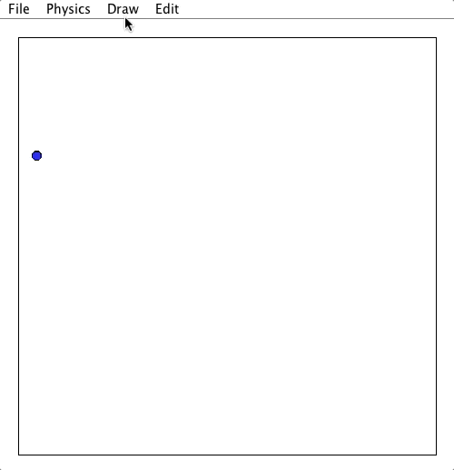

## Purpose ##

This project implements a physics engine for simulating a bouncing ball. Irregular shapes (triangles, quadrilaterals, etc.) can be easily drawn and modified within the simulation, and will then act as obstacles for the ball. Simulator "maps" can be drawn within the simulation window and saved to or loaded from files, using an automatically annotated and easily readable plaintext file format. Clicking and dragging while the simulation is running draws a new velocity vector for the ball, like using a slingshot.

This project was more of a programming and problem solving challenge than a rigorous physics exercise, so the physics in the simulator are not perfectly accurate to a particular scale, but are instead meant to look approximately correct. For example, the engine's scale is simply measured in pixels rather than meters or another translatable unit.

## Features ##

* Balls in the simulation will bounce off of obstacles, which can be lines or convex / concave polygons with any number of sides

  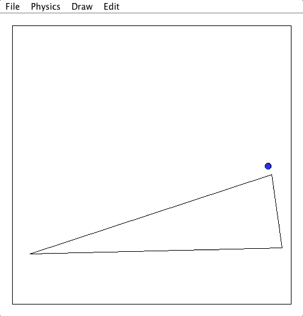

* Apply a velocity vector to the ball(s) in the simulation by clicking and dragging, similar to using a slingshot

  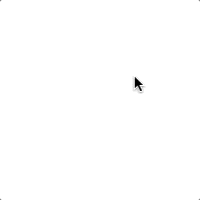

* Draw irregular triangular or quadrilateral obstacles within the simulation

  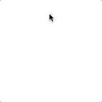
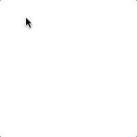
* Move individual obstacle vertices or move entire obstacles by clicking and dragging

  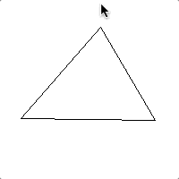
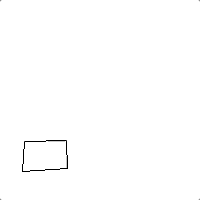
* Delete obstacles

* Save and load maps

* Additional functionality can be accessed by manually editing map text files, which have a simple and readable self-documenting plaintext format.

    * Multiple balls can be added to the simulation (though ball-to-ball collision is not yet implemented).

    * The colors of balls can be changed using 24-bit RGB color values.

    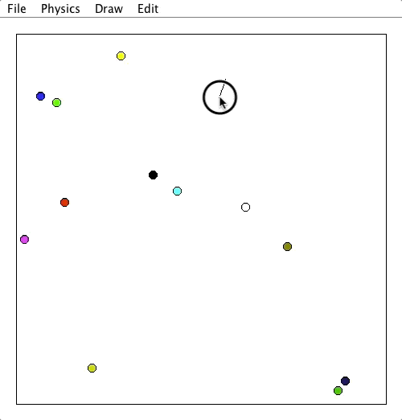

    * Individual lines can be added to simulation, as well as polygons with any number of sides; the simulation GUI currently only allows for 3- and 4- sided polygons to be drawn in-simulation, but the algorithm can handle more or fewer sides. Once these unusual obstacles are added to a map file, they can be easily modified within the simulator just like any other obstacle.

    Manipulating a complex 10-sided shape:

    

    * Simulation window size is adjustable.

    * The black square border near the outside of the simulation is optional.

## Getting Started ##

To start the simulation, run `Launcher.class` in the `launcher` package.

## Implementation Approach ##

The code for the simulator can be found in the `physics_simulator` package.

#### Collision Algorithm ####

Collision checking in the simulator works by moving each ball incrementally along its velocity vector, drawing segments perpendicular to each nearby shape edge through the center of the ball, and checking if the length of those perpendicular segments is less than the radius of the ball, in which case a collision is occurring. Each potential new ball position is tested for collisions before the ball's position is actually changed, and if a collision is detected, the ball stops where it is, and its velocity vector is modified based on the angle between it and the wall the ball is colliding with.

Interesting math that this algorithm uses:
* A rotational matrix is used to rotate points and segments around a particular point.

* Trigonometry: arctangent is used to calculate the angle between two lines.

* Vector normalization is used to find points a certain distance along a line

#### Three Modes of Operation ####

Behind the scenes, the simulator can be in one of three states, which can be selected using the dropdown menus at the top of the simulation window:
* Physics mode, where velocity vectors can be drawn and applied to the balls in the simulation and the balls will react accordingly

* Draw mode, where all balls temporarily freeze in place and 3- or 4- sided polygon obstacles can be drawn within the simulation

* Edit mode, where all balls temporarily freeze in place and obstacles in the simulation can be modified by either moving a single vertex at a time or by moving entire shapes.

## Optimizations ##

When there are many obstacles and balls in the simulation, checking for collisions would take too much time if there were not a few optimizations implemented.

##### Hit Boxes #####

Hit boxes are rough approximations of obstacles, which are used by the simulator to determine whether a ball could possibly be colliding with that obstacle. These approximations are much faster to check than the exact, more complex shapes, and this process usually allow the simulator to rule out collision with most obstacles on the map, preventing excess computation. In other words, the simulator will only check for collisions with a particular shape when the ball is within that shape's hit box. This can save a lot of time.

Hit boxes can be shown in the simulation for debugging purposes by changing the value of the field `boolean DRAW_HIT_BOXES` to `true` in the `Window.java` class within the `physics_simulator` package.

This complex map would run slowly without optimization via hit boxes, which are shown in red:

##### Distance Formula #####

The simulator requires frequent use of the Euclidean distance formula to operate. Euclidean distance usually requires a square root operation to be computed, but calculating a square root has a high time-complexity. To save time, the simulator leaves out the square root operation, and instead squares the value it is comparing a distance calculation to.

## Map File Format ##

Map files are stored as `.txt` files, and can be saved and loaded using a standard file dialog within the simulator (`File -> Save`, `File -> Load`). The simulator is configured to save files with annotations that make them very easy to understand and modify.

Here is an example of a working simulator map file (the first few lines configure the map size and border, and the rest define objects within the simulation):

    height: 500
    width: 500
    draw_border: true

    players: 1

    start_x_coordinate: 50.0
    start_y_coordinate: 202.0
    start_x_velocity: 0.0
    start_y_velocity: -3.5
    color_red_value: 0
    color_green_value: 0
    color_blue_value: 255

    shapes: 2

    number_of_vertices: 3
    vertex: 102.0 376.0
    vertex: 436.0 370.0
    vertex: 332.0 308.0

    number_of_vertices: 4
    vertex: 134.0 63.0
    vertex: 300.0 78.0
    vertex: 286.0 170.0
    vertex: 128.0 183.0

## Test Modules ##

Throughout the design and implementation of this project, I found it helpful to create test modules, which would verify that individual components of the simulator were working separately before they were combined. All test modules can be found in the `test_modules` package.

##### AngleBetween.java #####
This test module finds the angle between two line segments and performs a reflection of one segment off of the other. In other words, the test module imitates the reflection of a ball off of an angled wall. This module tests rotating a segment around a point using a rotational matrix, and finding the angle between two lines using arctangent.

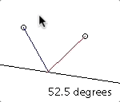

##### IntersectingSegments.java #####
This test module uses algebra to determine whether two line segments are intersecting. This is required for the simulator's collision algorithm to work properly.

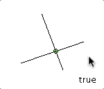

##### Separating Axis Theorem Test Modules #####

Test modules were written for an alternative collision detection algorithm called Separating Axis Theorem, but this algorithm is not currently utilized by the simulator for the sake of simplicity and because it is limited to use with convex polygons.

* SegmentProjection.java

  This test module projects a segment onto an a line, as if the segment were casting a shadow.

  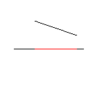

* ShapeProjection.java

  This test module projects a shape onto an a line, as if the shape were casting a shadow.

  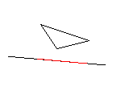

* SeparatingAxisTheorem.java

  This test module implements collision detection between two convex shapes using separating axis theorem, which relies on shape projection to detect collisions.

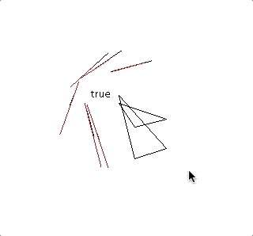

## Additional Images ##

Moving vertices in context:

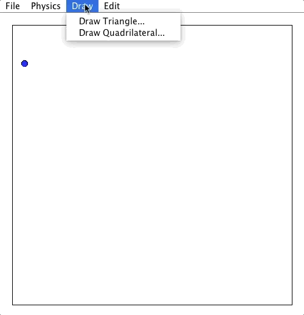

Moving shapes in context:

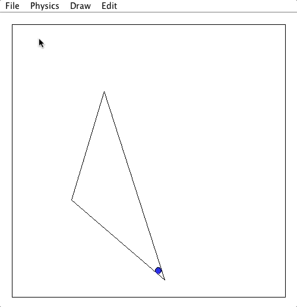

## Areas For Improvement ##

* Implement ball-to-ball collisions (currently, when multiple balls are in the simulation, they collide with obstacles, but not with each other)

* Improve algorithm for reflection of balls off of obstacle corners (currently, this type of collision is only roughly approximated)

* Improve algorithm for decrease in velocity after hitting an obstacle (currently, constant of restitution / loss of momentum is only roughly approximated)

* Implement adjustable radii and masses for balls

* Add GUI access for simulator functionality that is currently only accessible by modifying map files:

  * Drawing lines, and polygons with more than four sides

  * Adding and removing balls from the simulation

  * Changing the starting velocities of balls

  * Changing the colors of balls

  * Changing the size of the simulation window and toggling the square border

* Add functionality to change the colors of obstacles

## Acknowledgements ##

Thanks to Professor Michael Skalak for guidance on this project, and thanks to Physics 131 Teaching Assistant Hieu Le for introducing me to rotational matrices when I asked him if he had any ideas on how to rotate a segment around a point!

## See Also ##
This project is the spiritual successor to the Littleman's World Builder project, a two-dimensional platformer game engine with a Microsoft-Paint-style map maker. Many of the mistakes made on that project informed the design and implementation of the Bouncing Ball project, but the finished product of the former is very different than that of the Bouncing Ball project.
